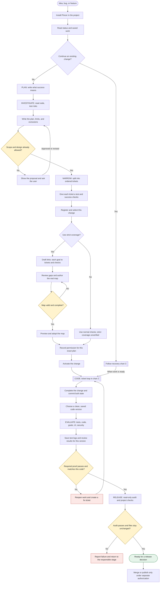
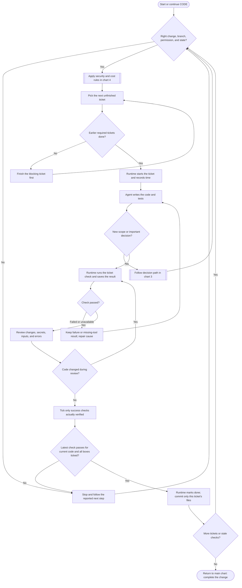
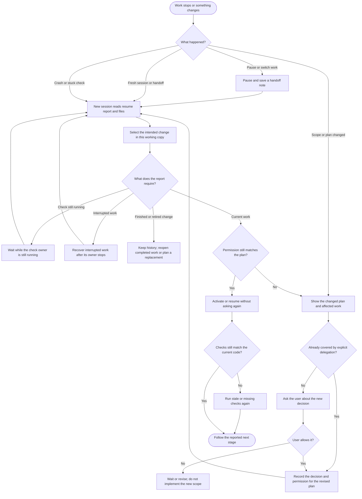
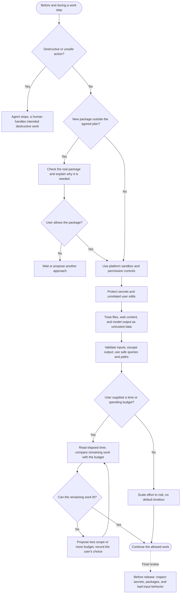

# How Pincer works

PINCER means **Plan, Investigate, Narrow, Code, Evaluate, Release**.
Investigation happens inside Plan, so there are five main commands.

New to the workflow? Read the [main-flow walkthrough for junior developers](pincer-main-flow-explained.md) for an explanation of every box and decision, with a running example.

Read the main journey first. The three detail charts explain its ticket loop,
interruptions, and security/cost decisions. Diamonds are gates: follow the labeled
answer. A blocked gate means fix the cause, not bypass the check.

These diagrams describe the current repository's workflow with registered changes.
Older installs can retain legacy receipts until an explicit migration. They do not
show the proposed improvements in the September 15 assessment as existing features.

## 1. The whole journey

A **plan**, called a PRD, describes the intended behavior. A **ticket** is one
small, testable piece of work. A **candidate** is the exact saved code version being
reviewed. **Evidence** is the saved test output, screenshots and review notes for it.

Strict coverage is optional. It checks that every planned scenario has explicit
links to work and proof, or an authorized decision to defer/remove it. The scaffold
only helps write the map: it does not choose correct links, invent tests, adopt the
map, or approve the work. A reviewer still judges whether the checks are adequate.
If the user declines a proposal, work waits or the proposal is revised.

## 2. How one ticket gets implemented

A green build alone does not prove the requested behavior. Tests should exercise
what users need, bad-input paths, and existing behavior that must keep working.
A required tool that cannot run is **unverified**, never an invented pass.
A newer failure overrides an older pass. Changed code or check commands can make
old results stale. After migration, closing a ticket consumes the current recorded
pass; it does not run the test a second time.

## 3. Decisions, stopping, and coming back later

A general “continue” does not approve new scope. A change to code may require new
tests without requiring new permission; a change to the agreed plan requires a
recorded permission decision. Removing promised behavior needs the user's explicit
scope decision, retained in the plan and, when strict, the coverage map.

Plans, tickets, decisions and saved evaluation evidence travel with Git. Selection
and local test attempts belong to each working copy. A new clone cannot claim it
has local test history it did not receive. Never erase failed results or hand-edit
runtime state to make the report green. Cancelled or replaced changes remain history.
An older install needing migration first shows a preview and obtains permission;
migration preserves old results as history rather than treating them as new proof.

## 4. Security and cost rules throughout the work

These are workflow rules plus platform controls, not a promise that one script can
prove code secure. Claude hooks block documented dangerous-command and protected-state
edit patterns; other supported surfaces rely on their native controls and the shared
rules. Hooks are an extra safety layer, not a complete security boundary.

Never print secret values, commit `.env` files, or put API keys in browser code.
Use `.env.example` for names only. Keep credentials server-side. Check history as
well as current files: deleting a committed secret does not undo its exposure.

Pincer controls effort through small versus standard planning, focused checks,
concise resume output, reused authorization and explicit scope choices. Status uses
the clock without calling a model, but **elapsed time is not active work time or a
billing total**. Ordinary workflow budgets guide the agent; Pincer is not a universal
hard dollar-limit enforcer. Checks have timeouts. Paid benchmark trials are a separate
maintainer activity requiring agreed spending limits; their driver has a wall-clock
cap, and their runner still has the issues recorded in the September 15 assessment.
They are not run as part of ordinary delivery or paid calls inside `npm test`.

## Who makes which decision?

| Who | Responsibility |
| --- | --- |
| User | Owns scope, important choices, new spending, and merge/publication authorization; can delegate choices explicitly |
| Coding agent | Investigates, proposes, writes tickets/code/tests, follows the playbooks, reports uncertainty and progress |
| Reviewer | Judges behavior, design, security, UI and whether the checks really prove the promised behavior |
| Runtime scripts | Check recorded permission/state, dependencies, latest results, code identity and evidence consistency; refuse invalid transitions |
| Platform sandbox and permissions | Limit which system actions the agent can perform |

A recorded permission is local provenance, not proof of the user's authenticated
identity. A valid evidence file means its records are consistent; it is not by itself
proof that an authored review was correct. **Done** means a ticket passes its checks;
**completed** means the change is ready for evaluation; **release PASS** means the
audited candidate passed the workflow checks. None automatically publishes anything.

## Commands and saved files

| Stage | Main command | What it leaves behind |
| --- | --- | --- |
| Orient | `/pincer-status` | Read-only report and next step |
| Plan and investigate | `/pincer-plan` | `.prd/prd-vN.md` |
| Break down work | `/pincer-narrow` | `tickets/T-*.md`, change record, optional coverage map |
| Implement | `/pincer-code` | Code, ticket commits, local recorded test attempts |
| Review | `/pincer-evaluate` | Candidate-bound evidence and `NOTES.md` |
| Audit | `/pincer-release` | Read-only PASS/FAIL report; no automatic publishing |

On Codex, invoke the corresponding `$pincer-plan`, `$pincer-narrow`, `$pincer-code`,
`$pincer-evaluate`, `$pincer-release`, and `$pincer-status` skills. Command labels here
follow this repository's adapters, not a claim about every platform's current features.

Source of truth: [Plan](../template/.claude/commands/pincer-plan.md),
[Narrow](../template/.claude/commands/pincer-narrow.md),
[Code](../template/.claude/commands/pincer-code.md),
[Evaluate](../template/.claude/commands/pincer-evaluate.md),
[Release](../template/.claude/commands/pincer-release.md),
[project rules](../template/AGENTS.md), and
[runtime contracts](../template/docs/runtime-contracts.md).
